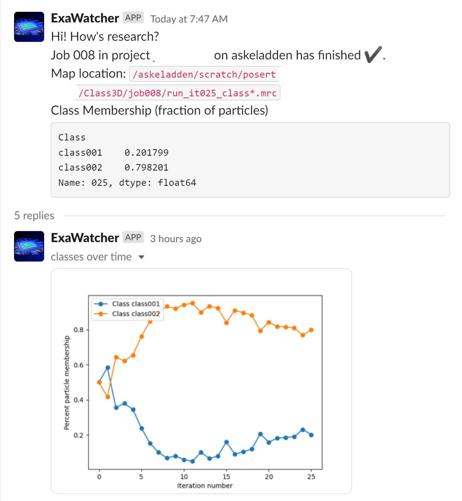

# ExaWatcher 💾👀

ExaWatcher is a lightweight, cron-based system for monitoring RELION jobs. It is designed to be very easy to use on a compute cluster or a single workstation, regardless of permissions. No persistent services are required, and nothing more than python libraries need to be installed.



## Requirements ☑️
You have to have python, and the ability to install python libraries.

## Installation 👷

### Exawatcher
 1. Create a virtual environment
    - Example: `python3 -m virtualenv exavenv`
 2. Source the virtual env
    - Example: `source exavenv/bin/activate`
 3. Install the requirements
    - Example: `python3 -m pip install -r requirements.txt`

### Slack Authentication
To send slack messages, you must [create a slack bot](https://slack.com/help/articles/115005265703-Create-a-bot-for-your-workspace) with the following permissions:
 - `chat:write`
 - `files:write`

Once you've created your bot, store the key in your ExaWatcher database. For example:
```
/path/to/exa_watcher.py --slack-key {your Bot User OAuth Token}
```

By default, the ExaWatcher database is stored at `~/exawatcher.db`. If you'd like
it somewhere else, you can pass `--db /path/to/database` to all ExaWatcher commands
to give it a new location.

Next, find your slack DM channel. The easiest way is: 
 1. Open Slack
 2. Open your profile
 3. Click the "... More" circle
 4. Copy Member ID

Add this ID to your ExaWatcher database. For example:
```
/path/to/exa_watcher.py --slack-dm-id {your Member ID}
```

If everything worked correctly, running
```
/path/to/exa_watcher.py --test-slack
```
should result in you receiving a DM from your Slack bot reading
> Slack client successful.

## Usage 🛠️

### Project management
ExaWatcher tracks jobs within each RELION project. You must give ExaWatcher the location
of each project directory (i.e., the directory with `default_pipeline.star` in it --- the one you open RELION in).

```
/path/to/exa_watcher.py --new-project /path/to/relion/project
```

This adds the project to ExaWatcher with the name, in this case, "project". You can check
currently-tracked projects with

```
/path/to/exa_watcher.py --list-projects
```
and remove projects with
```
/path/to/exa_watcher.py --remove-project {project name}
```

You must give the name, not the path. This does not delete any files,
only stops ExaWatcher from tracking them. Having finished projects in
ExaWatcher doesn't cost much, since searching for jobs is quite fast, but
it's still probably worth removing them when you're done to keep things snappy.

### Processing
To process all projects, run
```
/path/to/exa_watcher.py --process-all
```
If any jobs in any tracked projects have changed state, you will be sent a DM
with the old job state, the new job state, and (if the job is finished), some
information about the results. Right now, the only jobs that are tracked are

 - Extract
   - You will be sent the number of particles
 - Initial Model
   - You will be sent projections of all maps
 - Refine 3D
   - You will be sent the final resolution
   - You will be sent an FSC curve
   - You will be sent a map projection
 - Class 3D
   - You will be sent a graph of class occupancy per iteration
   - You will be sent projections of all maps
 - Post Process
   - You will be sent the final resolution
   - You will be sent a projection of the unmasked processed map
 - CTF Refine
   - You will be sent the logfile PDF
 - MultiBody Refinement
   - You will be sent the final resolution
   - You will be sent information about the major eigenvectors
   - You will be sent projections of all bodies

and the current states are

 - Pending (job has not started)
 - Running (job is running, i.e., `run.out` exists)
 - User Abort (job aborted using RELION GUI/filesystem)
 - Failed (RELION wrote "RELION_JOB_EXIT_FAILURE" to job directory)
 - Finished (job completed successfully)

If you prefer slices through the middle of the map, you can set this preference
in your database with

`exa_watcher.py --set-map-process slice`

To process only a specific project, use `--process-project {project name}`. You can
force all jobs to send DMs regardless of state with
`--force-process` but it's probably better to manually
delete `.exawatcher/last_status.txt` in the jobs you want to process.

If you are adding an existing project to ExaWatcher with many finished jobs,
you may want to run 
```
/path/to/exa_watcher.py --process-all --no-process
```
which, while confusing to read, will create the necessary files in all jobs without
sending you tons of DMs about jobs you've already inspected.

### Cron job
To avoid requiring a persistent service (not an option on most clusters), ExaWatcher
expects to run as a cron job. These are jobs which run at a set interval. I recommend
creating a script which sources the necessary modules and runs ExaWatcher. For instance:

```
#!/bin/bash
source /path/to/exawatcher_venv/bin/activate

/path/to/exa_watcher.py --process-all
```

Then, set up a cron job to run this at your desired frequency. If you're not familiar
with cron jobs, you may find [this resource](https://crontab.guru/) useful.

## Common Pitfalls 🐛
If you run into some kind of uncaught exception, the database will remain locked.
The database is locked during processing to prevent high-frequency cron jobs
from processing the same job multiple times. To unlock it after an error, run
```
/path/to/exa_watcher.py --clear-lock
```
or delete `.dblock` in your database directory.

If you run into any other bugs, or have feature requests, feel free to submit an issue.
This script is under active development. I especially encourage PRs to support new
job types.